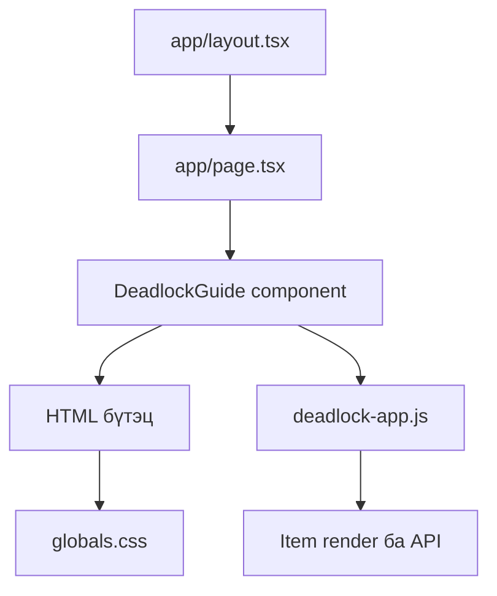
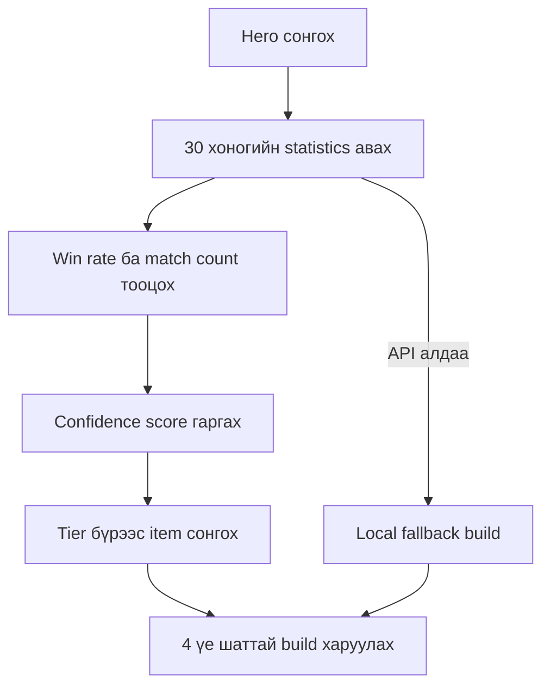
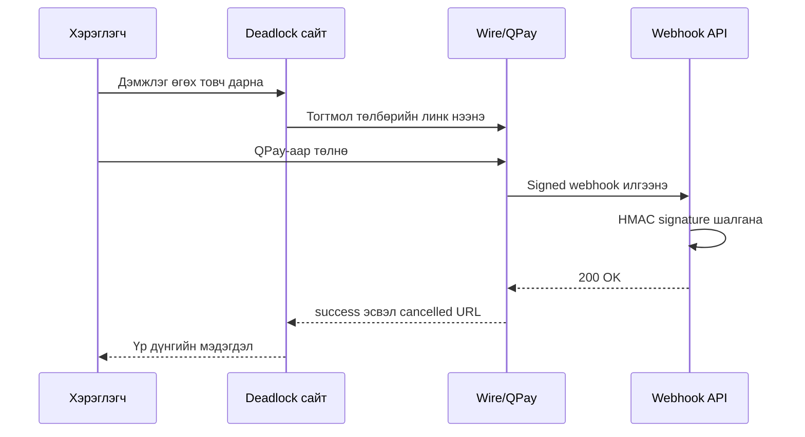

# Deadlock Mongolia — кодын тайлбар

Энэ баримт нь `DeadLock-Mongolia` төслийн бүтэц, үндсэн функцүүд, өгөгдлийн урсгал, Deadlock API болон Wire төлбөрийн холболтыг Монгол хэлээр тайлбарлана.

## 1. Төслийн зорилго

Deadlock Mongolia нь Монгол тоглогчдод зориулсан веб гарын авлага. Хэрэглэгч:

- item-уудыг дэлгүүрийн ангилал болон түвшнээр харах;
- нэр, тайлбараар хайх;
- item бүрийн дэлгэрэнгүй ажиллагаа, авах үе, тохирох hero болон counter зөвлөмжийг унших;
- hero сонгоод сүүлийн үеийн статистикт тулгуурласан build гаргах;
- Deadlock Mongolia Discord community-д нэгдэх;
- Wire/QPay ашиглан хүссэн дүнгээрээ дэмжлэг үзүүлэх боломжтой.

Production сайт: <https://dead-lock-mongolia.vercel.app/>

## 2. Ашигласан технологи

| Технологи | Үүрэг |
|---|---|
| Next.js 15 App Router | Хуудас, layout, API route болон production build |
| React 19 | Үндсэн component render хийх |
| TypeScript | Next.js component болон webhook-ийн type safety |
| Vanilla JavaScript | Item каталог, хайлт, filter, modal, API болон build generator |
| CSS | Responsive layout, өнгө, animation, modal болон mobile дизайн |
| Deadlock API | Hero, item болон item statistics авах |
| Wire / QPay | Нээлттэй дүнтэй төлбөр хүлээн авах |
| Vercel | Hosting, environment variable, serverless API болон analytics |

## 3. Фолдерын бүтэц

```text
DeadLock-Mongolia/
├── app/
│   ├── api/wire/webhook/route.ts  # Wire webhook backend
│   ├── globals.css                # Бүх UI загвар
│   ├── layout.tsx                 # Metadata, viewport, analytics
│   └── page.tsx                   # Нүүр хуудас
├── components/
│   └── deadlock-guide.tsx         # Үндсэн HTML бүтэц ба Wire floating button
├── public/
│   └── deadlock-app.js            # Өгөгдөл, API, DOM logic, build generator
├── legacy/
│   └── index.html                 # Next.js рүү шилжүүлэхээс өмнөх хувилбар
├── scripts/
│   └── migrate-to-next.mjs        # Legacy HTML-ийг CSS/JS/component болгон салгах script
├── package.json
├── tsconfig.json
└── README.md
```

## 4. Апп хэрхэн ачаалдаг вэ?



1. `app/layout.tsx` бүх хуудсыг бүрхэнэ.
2. `app/page.tsx` нүүр хуудсанд `DeadlockGuide` component-ийг render хийнэ.
3. `components/deadlock-guide.tsx` үндсэн HTML markup-ийг гаргана.
4. `next/script` ашиглан `/deadlock-app.js`-ийг browser дээр ачаална.
5. JavaScript DOM элементүүдийг олж, item cards, build generator болон event listener-үүдийг ажиллуулна.
6. `app/globals.css` бүх component-ийн харагдах байдал болон responsive дизайныг удирдана.

## 5. `app/layout.tsx`

Энэ файл:

- сайтын title болон description;
- SEO keywords;
- canonical URL;
- Open Graph мэдээлэл;
- mobile viewport;
- theme color;
- Vercel Analytics-ийг тохируулна.

```tsx
export default function RootLayout({ children }) {
  return (
    <html lang="mn">
      <body>
        {children}
        <Analytics />
      </body>
    </html>
  );
}
```

`lang="mn"` нь хуудасны үндсэн хэл Монгол гэдгийг browser болон search engine-д мэдэгдэнэ.

## 6. `app/page.tsx`

Нүүр хуудас маш энгийн:

```tsx
import { DeadlockGuide } from "@/components/deadlock-guide";

export default function HomePage() {
  return <DeadlockGuide />;
}
```

Бодит UI нь `DeadlockGuide` component дотор байрладаг.

## 7. `components/deadlock-guide.tsx`

### `pageMarkup`

Энэ тогтмол string дотор хуучин HTML бүтцийг хадгалсан. Үүнд:

- social links;
- header;
- Discord хэсэг;
- hero build generator-ийн control;
- shop tabs;
- хайлт болон tier filters;
- item render хийх `#content` container;
- item modal;
- footer;
- back-to-top button орно.

Markup-ийг дараах байдлаар DOM-д оруулдаг:

```tsx
<div
  className="site-root"
  dangerouslySetInnerHTML={{ __html: pageMarkup }}
  suppressHydrationWarning
/>
```

Энэ бүтэц нь legacy HTML-ээс Next.js рүү хурдан шилжүүлсэн шийдэл. Цаашид component-уудыг жижиг React component болгон салгавал засварлах, test хийхэд хялбар болно.

### Wire floating button

Баруун доод буланд тогтмол харагдах Wire товч мөн энэ component-д бий:

```tsx
const WIRE_SUPPORT_URL =
  "https://pay.wire.mn/link/plink_krd6jmuhq3y6mrrkog7o43mvne";
```

Энэ нь Wire dashboard дээр үүсгэсэн **нээлттэй дүнтэй** payment link. Хэрэглэгч төлөх дүнгээ өөрөө оруулна.

## 8. `public/deadlock-app.js`

Энэ бол төслийн үндсэн client-side logic байрладаг файл.

### 8.1 `DATA` — item мэдээлэл

`DATA` объект гурван shop ангилалтай:

- `fairfax` — Weapon/Bullet төрлийн item;
- `mps` — Vitality/Defense төрлийн item;
- `cc` — Spirit/Utility төрлийн item.

Item-ийн ерөнхий бүтэц:

```js
{
  t: 1,
  n: "Close Quarters",
  d: "Ойрын зайд бууны хохирол нэмэгдэнэ.",
  img: "https://deadlock.wiki/images/...png",
  active: 1,
  imbue: 1
}
```

| Талбар | Тайлбар |
|---|---|
| `t` | Item-ийн tier буюу түвшин |
| `n` | Англи нэр |
| `d` | Монгол товч тайлбар |
| `img` | Item зургийн URL |
| `active` | Гараар идэвхжүүлдэг item бол `1` |
| `imbue` | Нэг ability-д холбодог item бол `1` |

### Шинэ item нэмэх

Тохирох shop-ийн `items` array дотор шинэ объект нэмнэ:

```js
{
  t: 2,
  n: "New Item",
  d: "Монгол тайлбар.",
  img: "https://example.com/item.png"
}
```

Дараа нь build болон modal зөвлөмж шаардлагатай бол `ITEM_UPGRADES`, `GUIDE_OVERRIDES` эсвэл shop guide-д нэмэлт тохиргоо хийнэ.

### 8.2 Hero болон build-ийн дотоод мэдээлэл

- `ALL_HEROES` — API ажиллахгүй үед ашиглах hero жагсаалт.
- `HERO_POOLS` — hero-г precision, close-range, spirit, tank, weapon чиглэлээр бүлэглэнэ.
- `ITEM_UPGRADES` — нэг item-ийн дараагийн хүчтэй хувилбарыг холбоно.
- `SHOP_GUIDES` — shop бүрийн ерөнхий role, hero, build болон counter мэдээлэл.
- `GUIDE_OVERRIDES` — тодорхой item-д зориулсан тусгай тайлбар.

### 8.3 Deadlock API холболт

```js
const API_BASE = "https://api.deadlock-api.com/v1";
const META_WINDOW_DAYS = 30;
const API_CACHE_HOURS = 6;
```

Апп дараах төрлийн мэдээллийг авна:

```text
/assets/heroes?language=english
/assets/items/by-type/upgrade?language=english
/analytics/item-stats?hero_ids=...&min_unix_timestamp=...&min_matches=20
```

### 8.4 Cache

`readCache()` болон `writeCache()` нь API хариуг `localStorage`-д хадгална.

- Cache 6 цаг хүчинтэй.
- Хүчинтэй cache байвал дахин API дуудахгүй.
- API request 10 секундээс удаан бол `AbortController` хүсэлтийг зогсооно.

Ингэснээр API ачаалал багасч, хэрэглэгчид илүү хурдан мэдээлэл харагдана.

### 8.5 API fallback

`initializeLiveMeta()` API-аас hero болон item татна. Амжилтгүй бол:

```js
liveHeroes = localFallbackHeroes();
```

гэсэн дотоод жагсаалт ашиглана. Тиймээс гаднын API түр ажиллахгүй байсан ч үндсэн каталог болон build generator бүрэн эвдрэхгүй.

### 8.6 Build generator

Build үүсгэх дараалал:



`scoreItemStat()` дараах мэдээллийг харгалзана:

- хэдэн тоглолтод ашигласан;
- хэдэн ялалт авсан;
- win rate;
- sample size буюу статистикийн хэмжээ.

Цөөн тоглолттой item санамсаргүй өндөр win rate-тай байсан ч хэт дээгүүр орохгүй байхаар confidence score ашигладаг.

`selectBuildItems()` build-ийг дөрвөн хэсэгт хуваана:

1. Шугамын эхлэл — Tier 1;
2. Тоглолтын эхэн — Tier 2;
3. Тоглолтын дунд үе — Tier 3;
4. Тоглолтын төгсгөл — Tier 4.

### 8.7 Item card, хайлт болон filter

`render()` нь сонгосон shop, tier болон search утгад тохирох item-уудыг DOM-д үүсгэнэ.

Төлөв хадгалах хувьсагчид:

```js
let currentShop = "fairfax";
let currentTier = "all";
let currentSearch = "";
```

Хэрэглэгч tab, tier chip эсвэл search input-ийг өөрчлөх бүрд `render()` дахин ажиллана.

### 8.8 Item дэлгэрэнгүй modal

`openItemGuide(item, shopKey)` дараах мэдээллийг modal-д гаргана:

- зураг, shop, tier, үнэ;
- item хэрхэн ажилладаг;
- идэвхжих нөхцөл;
- хэрэглэх дараалал;
- авах зөв үе;
- тохирох build болон hero;
- counter зөвлөмж;
- өмнөх болон дараагийн upgrade;
- анхаарах зүйл;
- Wire нээлттэй дүнгийн дэмжлэгийн товч.

`escapeHtml()` нь API эсвэл өгөгдлөөс орж ирсэн текстийг HTML болгон шууд ажиллахаас хамгаална.

### 8.9 Төлбөрийн үр дүн

Wire төлбөрийн дараа дараах URL-ийн аль нэг рүү буцаана:

```text
/?payment=success
/?payment=cancelled
```

`showPaymentResult()` query parameter-ийг уншиж:

- `success` бол ногоон амжилтын мэдэгдэл;
- `cancelled` бол шар цуцлалтын мэдэгдэл харуулна.

Мэдэгдэл гарсны дараа parameter-ийг browser history-оос арилгаж, 8 секундын дараа мэдэгдлийг хаана.

> Анхаарах: Query parameter нь зөвхөн хэрэглэгчид мэдээлэл харуулах зориулалттай. Төлбөр үнэхээр орсныг backend дээр webhook-оор баталгаажуулна.

## 9. `app/globals.css`

CSS файл дараах үндсэн хэсгүүдтэй:

- өнгө болон global style;
- social links болон header;
- Discord banner;
- shop tabs, search, tier filters;
- item grid болон cards;
- item guide modal;
- hero build generator;
- payment result notification;
- Wire floating button;
- back-to-top button;
- mobile/tablet media queries.

`.wire-float` нь desktop дээр баруун доод буланд байрлана. Mobile дээр back-to-top товчтой давхцахгүй байхаар арай дээш байрладаг.

Хуучин SocialPay QR хэсгийг:

```css
.donation,
.qr-modal {
  display: none !important;
}
```

гэж нууж, Wire-ийн тогтмол товчоор сольсон.

## 10. Wire webhook backend

Файл:

```text
app/api/wire/webhook/route.ts
```

Production endpoint:

```text
https://dead-lock-mongolia.vercel.app/api/wire/webhook
```

### GET request

Endpoint ажиллаж байгаа болон secret тохируулагдсан эсэхийг шалгана:

```json
{
  "ok": true,
  "service": "wire-webhook",
  "configured": true
}
```

Secret-ийн утгыг хэзээ ч буцаахгүй, зөвхөн байгаа эсэхийг boolean утгаар харуулна.

### POST request

Wire webhook ирэхэд:

1. `WIRE_WEBHOOK_SECRET` environment variable байгаа эсэхийг шалгана.
2. `WirePayment-Signature` header-ийг уншина.
3. Header-ээс `t` timestamp болон `v1` signature-ийг салгана.
4. Timestamp 5 минутаас хуучин эсэхийг шалгана.
5. Raw request body дээр HMAC-SHA256 signature шинээр тооцно.
6. Тооцсон болон ирсэн signature-ийг `timingSafeEqual()` ашиглан харьцуулна.
7. Зөв бол event-ийн `id`, `type`-ийг server log-д бичиж `200` хариу өгнө.
8. Буруу бол `401`, secret байхгүй бол `503` хариу өгнө.

Signature тооцох үндсэн хэсэг:

```ts
const expected = createHmac("sha256", secret)
  .update(`${parsed.timestamp}.${rawBody}`)
  .digest("hex");
```

### Environment variable

Local `.env.local` эсвэл Vercel Environment Variables дотор:

```env
WIRE_WEBHOOK_SECRET=whsec_your_secret_here
```

`whsec_...` secret-ийг:

- GitHub-д commit хийж болохгүй;
- client-side JavaScript-д хийж болохгүй;
- screenshot эсвэл public log-д харуулж болохгүй.

## 11. Wire төлбөрийн урсгал



## 12. `scripts/migrate-to-next.mjs`

Энэ script `legacy/index.html`-ээс:

- `<style>` хэсгийг `app/globals.css`;
- `<body>` хэсгийг `components/deadlock-guide.tsx`;
- `<script>` хэсгийг `public/deadlock-app.js`

болгон салгадаг.

> Чухал: Одоогийн Next.js файлууд дээр Wire, webhook, responsive болон бусад гараар хийсэн сайжруулалт байгаа. Migration script-ийг шууд дахин ажиллуулбал эдгээр файлыг хуучин legacy хувилбараар дарж болзошгүй. Эхлээд Git branch эсвэл backup үүсгэ.

## 13. Local орчинд ажиллуулах

Node.js суусан байх шаардлагатай.

```bash
git clone https://github.com/hosoo123/DeadLock-Mongolia.git
cd DeadLock-Mongolia
npm install
npm run dev
```

Дараа нь:

```text
http://localhost:3000
```

### Type шалгах

```bash
npm run lint
```

Энэ project-ийн `lint` script нь `tsc --noEmit` ажиллуулж TypeScript алдаа шалгана.

### Production build

```bash
npm run build
npm start
```

## 14. Vercel deploy

GitHub repository Vercel project-той холбогдсон. `main` branch руу push хийхэд production deployment автоматаар эхэлнэ.

Vercel тохиргоо:

- Framework Preset: Next.js;
- Root Directory: repository root;
- Build Command: `npm run build` буюу automatic;
- Environment Variable: `WIRE_WEBHOOK_SECRET`;
- Production domain: `dead-lock-mongolia.vercel.app`.

## 15. Код өөрчлөх хурдан лавлах

| Өөрчлөх зүйл | Файл/хэсэг |
|---|---|
| Item нэр, тайлбар, зураг | `public/deadlock-app.js` → `DATA` |
| Hero жагсаалт | `ALL_HEROES` |
| Hero бүлэг | `HERO_POOLS` |
| Item upgrade холбоос | `ITEM_UPGRADES` |
| Item-ийн тусгай зөвлөмж | `GUIDE_OVERRIDES` |
| API болон cache хугацаа | `API_BASE`, `META_WINDOW_DAYS`, `API_CACHE_HOURS` |
| Wire төлбөрийн линк | `WIRE_SUPPORT_URL` (`deadlock-guide.tsx`, `deadlock-app.js`) |
| Floating Wire товчны дизайн | `app/globals.css` → `.wire-float` |
| SEO title/description | `app/layout.tsx` |
| Webhook хамгаалалт | `app/api/wire/webhook/route.ts` |
| Responsive дизайн | `app/globals.css` media queries |

## 16. Цаашид сайжруулах санал

1. `pageMarkup`-ийг Header, Filters, ItemGrid, Modal, DonationButton зэрэг React component болгон салгах.
2. Item болон hero мэдээллийг тусдаа JSON эсвэл TypeScript файл руу гаргах.
3. DOM event listener-үүдийг React state болон event handler болгон шилжүүлэх.
4. Webhook event-ийг database-д хадгалж, event ID-аар давхар боловсруулалтаас хамгаалах.
5. API response-д runtime schema validation нэмэх.
6. Unit, integration болон end-to-end test нэмэх.
7. Legacy QR markup болон ашиглагдахгүй event handler-үүдийг бүрэн цэвэрлэх.

---

Энэ төсөл нь эхний HTML/CSS/JavaScript хувилбараас Next.js рүү шилжиж, live Deadlock statistics, offline fallback, responsive UI, Wire/QPay төлбөр болон хамгаалалттай webhook бүхий production веб апп болсон.
