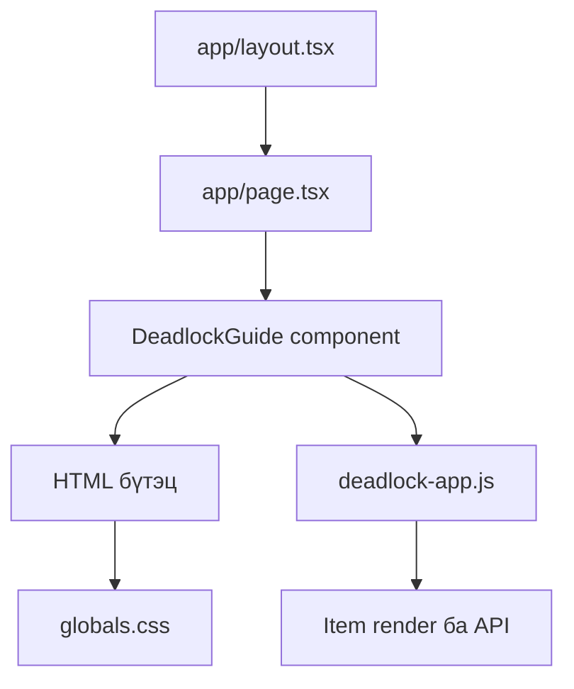
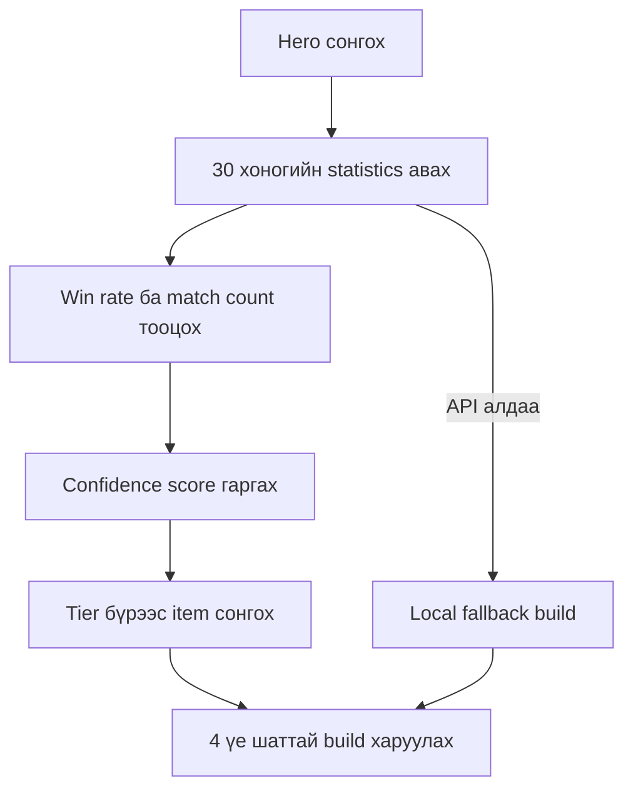
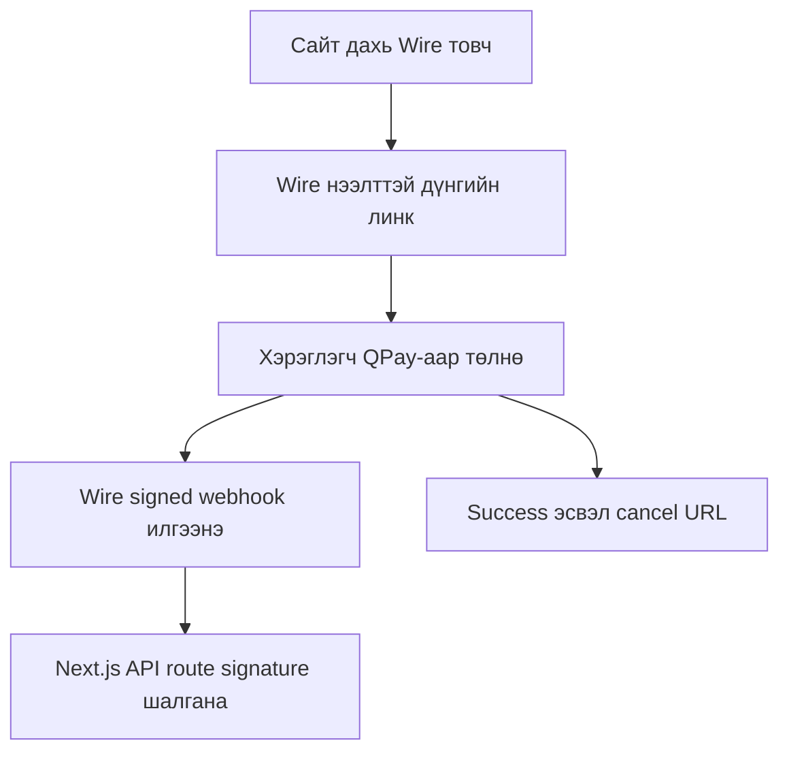
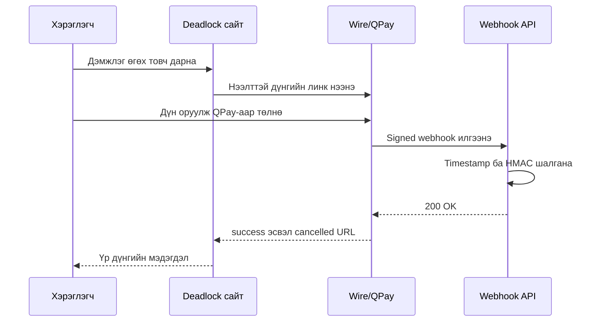

# Deadlock Mongolia — кодын тайлбар

Энэ баримт нь `DeadLock-Mongolia` төслийн бүтэц, үндсэн функцүүд, өгөгдлийн урсгал, Deadlock API болон Wire төлбөрийн холболтыг Монгол хэлээр тайлбарлана.

## 1. Төслийн зорилго

Deadlock Mongolia нь Монгол тоглогчдод зориулсан веб гарын авлага. Хэрэглэгч:

- item-уудыг дэлгүүрийн ангилал болон түвшнээр харах;
- нэр, тайлбараар хайх;
- item бүрийн дэлгэрэнгүй ажиллагаа, авах үе, тохирох hero болон counter зөвлөмжийг унших;
- hero сонгоод сүүлийн үеийн статистикт тулгуурласан build гаргах;
- Deadlock Mongolia Discord community-д нэгдэх;
- Wire/QPay ашиглан хүссэн дүнгээрээ дэмжлэг үзүүлэх боломжтой.

Production сайт: <https://dead-lock-mongolia.vercel.app/>

## 2. Ашигласан технологи

| Технологи | Үүрэг |
|---|---|
| Next.js 15 App Router | Хуудас, layout, API route болон production build |
| React 19 | Үндсэн component render хийх |
| TypeScript | Next.js component болон webhook-ийн type safety |
| Vanilla JavaScript | Item каталог, хайлт, filter, modal, API болон build generator |
| CSS | Responsive layout, өнгө, animation, modal болон mobile дизайн |
| Deadlock API | Hero, item болон item statistics авах |
| Wire / QPay | Нээлттэй дүнтэй төлбөр хүлээн авах |
| Vercel | Hosting, environment variable, serverless API болон analytics |

## 3. Фолдерын бүтэц

```text
DeadLock-Mongolia/
├── app/
│   ├── api/wire/webhook/route.ts  # Wire webhook backend
│   ├── globals.css                # Бүх UI загвар
│   ├── layout.tsx                 # Metadata, viewport, analytics
│   └── page.tsx                   # Нүүр хуудас
├── components/
│   └── deadlock-guide.tsx         # Үндсэн HTML бүтэц ба Wire floating button
├── public/
│   └── deadlock-app.js            # Өгөгдөл, API, DOM logic, build generator
├── legacy/
│   └── index.html                 # Next.js рүү шилжүүлэхээс өмнөх хувилбар
├── scripts/
│   └── migrate-to-next.mjs        # Legacy HTML-ийг CSS/JS/component болгон салгах script
├── package.json
├── tsconfig.json
└── README.md
```

## 4. Апп хэрхэн ачаалдаг вэ?



1. `app/layout.tsx` бүх хуудсыг бүрхэнэ.
2. `app/page.tsx` нүүр хуудсанд `DeadlockGuide` component-ийг render хийнэ.
3. `components/deadlock-guide.tsx` үндсэн HTML markup-ийг гаргана.
4. `next/script` ашиглан `/deadlock-app.js`-ийг browser дээр ачаална.
5. JavaScript DOM элементүүдийг олж, item cards, build generator болон event listener-үүдийг ажиллуулна.
6. `app/globals.css` бүх component-ийн харагдах байдал болон responsive дизайныг удирдана.

## 5. `app/layout.tsx`

Энэ файл:

- сайтын title болон description;
- SEO keywords;
- canonical URL;
- Open Graph мэдээлэл;
- mobile viewport;
- theme color;
- Vercel Analytics-ийг тохируулна.

```tsx
export default function RootLayout({ children }) {
  return (
    <html lang="mn">
      <body>
        {children}
        <Analytics />
      </body>
    </html>
  );
}
```

`lang="mn"` нь хуудасны үндсэн хэл Монгол гэдгийг browser болон search engine-д мэдэгдэнэ.

## 6. `app/page.tsx`

Нүүр хуудас маш энгийн:

```tsx
import { DeadlockGuide } from "@/components/deadlock-guide";

export default function HomePage() {
  return <DeadlockGuide />;
}
```

Бодит UI нь `DeadlockGuide` component дотор байрладаг.

## 7. `components/deadlock-guide.tsx`

### `pageMarkup`

Энэ тогтмол string дотор хуучин HTML бүтцийг хадгалсан. Үүнд:

- social links;
- header;
- Discord хэсэг;
- hero build generator-ийн control;
- shop tabs;
- хайлт болон tier filters;
- item render хийх `#content` container;
- item modal;
- footer;
- back-to-top button орно.

Markup-ийг дараах байдлаар DOM-д оруулдаг:

```tsx
<div
  className="site-root"
  dangerouslySetInnerHTML={{ __html: pageMarkup }}
  suppressHydrationWarning
/>
```

Энэ бүтэц нь legacy HTML-ээс Next.js рүү хурдан шилжүүлсэн шийдэл. Цаашид component-уудыг жижиг React component болгон салгавал засварлах, test хийхэд хялбар болно.

### Wire floating button

Баруун доод буланд тогтмол харагдах Wire товч мөн энэ component-д бий:

```tsx
const WIRE_SUPPORT_URL =
  "https://pay.wire.mn/link/plink_krd6jmuhq3y6mrrkog7o43mvne";
```

Энэ нь Wire dashboard дээр үүсгэсэн **нээлттэй дүнтэй** payment link. Хэрэглэгч төлөх дүнгээ өөрөө оруулна.

## 8. `public/deadlock-app.js`

Энэ бол төслийн үндсэн client-side logic байрладаг файл.

### 8.1 `DATA` — item мэдээлэл

`DATA` объект гурван shop ангилалтай:

- `fairfax` — Weapon/Bullet төрлийн item;
- `mps` — Vitality/Defense төрлийн item;
- `cc` — Spirit/Utility төрлийн item.

Item-ийн ерөнхий бүтэц:

```js
{
  t: 1,
  n: "Close Quarters",
  d: "Ойрын зайд бууны хохирол нэмэгдэнэ.",
  img: "https://deadlock.wiki/images/...png",
  active: 1,
  imbue: 1
}
```

| Талбар | Тайлбар |
|---|---|
| `t` | Item-ийн tier буюу түвшин |
| `n` | Англи нэр |
| `d` | Монгол товч тайлбар |
| `img` | Item зургийн URL |
| `active` | Гараар идэвхжүүлдэг item бол `1` |
| `imbue` | Нэг ability-д холбодог item бол `1` |

### Шинэ item нэмэх

Тохирох shop-ийн `items` array дотор шинэ объект нэмнэ:

```js
{
  t: 2,
  n: "New Item",
  d: "Монгол тайлбар.",
  img: "https://example.com/item.png"
}
```

Дараа нь build болон modal зөвлөмж шаардлагатай бол `ITEM_UPGRADES`, `GUIDE_OVERRIDES` эсвэл shop guide-д нэмэлт тохиргоо хийнэ.

### 8.2 Hero болон build-ийн дотоод мэдээлэл

- `ALL_HEROES` — API ажиллахгүй үед ашиглах hero жагсаалт.
- `HERO_POOLS` — hero-г precision, close-range, spirit, tank, weapon чиглэлээр бүлэглэнэ.
- `ITEM_UPGRADES` — нэг item-ийн дараагийн хүчтэй хувилбарыг холбоно.
- `SHOP_GUIDES` — shop бүрийн ерөнхий role, hero, build болон counter мэдээлэл.
- `GUIDE_OVERRIDES` — тодорхой item-д зориулсан тусгай тайлбар.

### 8.3 Deadlock API холболт

```js
const API_BASE = "https://api.deadlock-api.com/v1";
const META_WINDOW_DAYS = 30;
const API_CACHE_HOURS = 6;
```

Апп дараах төрлийн мэдээллийг авна:

```text
/assets/heroes?language=english
/assets/items/by-type/upgrade?language=english
/analytics/item-stats?hero_ids=...&min_unix_timestamp=...&min_matches=20
```

### 8.4 Cache

`readCache()` болон `writeCache()` нь API хариуг `localStorage`-д хадгална.

- Cache 6 цаг хүчинтэй.
- Хүчинтэй cache байвал дахин API дуудахгүй.
- API request 10 секундээс удаан бол `AbortController` хүсэлтийг зогсооно.

Ингэснээр API ачаалал багасч, хэрэглэгчид илүү хурдан мэдээлэл харагдана.

### 8.5 API fallback

`initializeLiveMeta()` API-аас hero болон item татна. Амжилтгүй бол:

```js
liveHeroes = localFallbackHeroes();
```

гэсэн дотоод жагсаалт ашиглана. Тиймээс гаднын API түр ажиллахгүй байсан ч үндсэн каталог болон build generator бүрэн эвдрэхгүй.

### 8.6 Build generator

Build үүсгэх дараалал:



`scoreItemStat()` дараах мэдээллийг харгалзана:

- хэдэн тоглолтод ашигласан;
- хэдэн ялалт авсан;
- win rate;
- sample size буюу статистикийн хэмжээ.

Цөөн тоглолттой item санамсаргүй өндөр win rate-тай байсан ч хэт дээгүүр орохгүй байхаар confidence score ашигладаг.

`selectBuildItems()` build-ийг дөрвөн хэсэгт хуваана:

1. Шугамын эхлэл — Tier 1;
2. Тоглолтын эхэн — Tier 2;
3. Тоглолтын дунд үе — Tier 3;
4. Тоглолтын төгсгөл — Tier 4.

### 8.7 Item card, хайлт болон filter

`render()` нь сонгосон shop, tier болон search утгад тохирох item-уудыг DOM-д үүсгэнэ.

Төлөв хадгалах хувьсагчид:

```js
let currentShop = "fairfax";
let currentTier = "all";
let currentSearch = "";
```

Хэрэглэгч tab, tier chip эсвэл search input-ийг өөрчлөх бүрд `render()` дахин ажиллана.

### 8.8 Item дэлгэрэнгүй modal

`openItemGuide(item, shopKey)` дараах мэдээллийг modal-д гаргана:

- зураг, shop, tier, үнэ;
- item хэрхэн ажилладаг;
- идэвхжих нөхцөл;
- хэрэглэх дараалал;
- авах зөв үе;
- тохирох build болон hero;
- counter зөвлөмж;
- өмнөх болон дараагийн upgrade;
- анхаарах зүйл;
- Wire нээлттэй дүнгийн дэмжлэгийн товч.

`escapeHtml()` нь API эсвэл өгөгдлөөс орж ирсэн текстийг HTML болгон шууд ажиллахаас хамгаална.

### 8.9 Төлбөрийн үр дүн

Wire төлбөрийн дараа дараах URL-ийн аль нэг рүү буцаана:

```text
/?payment=success
/?payment=cancelled
```

`showPaymentResult()` query parameter-ийг уншиж:

- `success` бол ногоон амжилтын мэдэгдэл;
- `cancelled` бол шар цуцлалтын мэдэгдэл харуулна.

Мэдэгдэл гарсны дараа parameter-ийг browser history-оос арилгаж, 8 секундын дараа мэдэгдлийг хаана.

> Анхаарах: Query parameter нь зөвхөн хэрэглэгчид мэдээлэл харуулах зориулалттай. Төлбөр үнэхээр орсныг backend дээр webhook-оор баталгаажуулна.

## 9. `app/globals.css`

CSS файл дараах үндсэн хэсгүүдтэй:

- өнгө болон global style;
- social links болон header;
- Discord banner;
- shop tabs, search, tier filters;
- item grid болон cards;
- item guide modal;
- hero build generator;
- payment result notification;
- Wire floating button;
- back-to-top button;
- mobile/tablet media queries.

`.wire-float` нь desktop дээр баруун доод буланд байрлана. Mobile дээр back-to-top товчтой давхцахгүй байхаар арай дээш байрладаг.

Хуучин SocialPay QR хэсгийг:

```css
.donation,
.qr-modal {
  display: none !important;
}
```

гэж нууж, Wire floating товчоор сольсон.

## 10. Wire холболтын дэлгэрэнгүй

> **Шинэчлэл:** Энэ бүлгийн зарим хэсэг хуучин нээлттэй дүнтэй payment-link
> хувилбарыг тайлбарладаг. Одоогийн Wire REST API → QPay → signed webhook →
> Gmail урсгалын бүрэн, шинэ тайлбарыг
> [`WIRE_PAYMENT_EMAIL_GUIDE.md`](./WIRE_PAYMENT_EMAIL_GUIDE.md)-ээс уншина уу.

### 10.1 Одоогийн төсөл Wire-ийг яг яаж ашигладаг вэ?

Одоогийн хувилбарын Wire холболт хоёр тусдаа хэсэгтэй:

1. **Payment link** — хэрэглэгчийг Wire-ийн бэлэн checkout хуудас руу оруулж төлбөр авна.
2. **Webhook API route** — Wire-ээс сервер рүү ирсэн event жинхэнэ эсэхийг шалгана.



> Чухал ялгаа: Одоогийн сайт Wire REST API ашиглан шинэ `PaymentIntent` үүсгэдэггүй. `sk_live_...` API key ч frontend кодод байхгүй. Төлбөрийг Wire dashboard дээр урьдчилан үүсгэсэн дахин ашиглах payment link-ээр авдаг. Харин `/api/wire/webhook` нь манай өөрийн Next.js API endpoint юм.

### 10.2 Wire dashboard дээр хийсэн тохиргоо

Wire dashboard дээр дараах дарааллаар тохируулсан:

1. `Deadlock Mongolia` project үүсгэсэн.
2. QPay оператор болон төлбөр хүлээн авах дансыг идэвхжүүлсэн.
3. **Төлбөрийн линк** хэсэгт `Deadlock Mongolia-г дэмжих` линк үүсгэсэн.
4. Дүнгийн төрлийг **Нээлттэй дүн** болгосон.
5. **Checkout → Үр дүнгийн хуудас** хэсэгт success/cancel буцах URL тохируулсан.
6. **Webhook** хэсэгт production endpoint URL бүртгэсэн.
7. Endpoint үүсэх үед гарсан `whsec_...` secret-ийг Vercel environment variable-д хадгалсан.

Одоогийн нээлттэй дүнгийн public URL:

```text
https://pay.wire.mn/link/plink_krd6jmuhq3y6mrrkog7o43mvne
```

Нээлттэй дүн учраас хэрэглэгч Wire checkout дээр төлөх мөнгөө өөрөө оруулна.

### 10.3 Frontend дээр payment link холбосон код

`components/deadlock-guide.tsx` файлд линкийг тогтмол хувьсагчаар хадгалдаг:

```tsx
const WIRE_SUPPORT_URL =
  "https://pay.wire.mn/link/plink_krd6jmuhq3y6mrrkog7o43mvne";
```

Баруун доод floating товч:

```tsx
<a
  className="wire-float"
  href={WIRE_SUPPORT_URL}
  target="_blank"
  rel="noopener noreferrer"
  aria-label="Deadlock Mongolia-г Wire QPay-аар хүссэн дүнгээр дэмжих"
>
  <span className="wire-float-brand">Wire · QPay</span>
  <strong>Дэмжлэг өгөх</strong>
  <small>Дүнгээ өөрөө оруулна</small>
</a>
```

- `target="_blank"` — Wire checkout-ийг шинэ tab-д нээнэ.
- `rel="noopener noreferrer"` — шинэ tab эх сайтыг JavaScript-аар удирдахаас хамгаална.
- `aria-label` — screen reader хэрэглэгчид товчны зорилгыг тодорхой хэлнэ.

Item modal нь `public/deadlock-app.js` дотор ижил URL ашигладаг:

```js
const WIRE_SUPPORT_URL =
  "https://pay.wire.mn/link/plink_krd6jmuhq3y6mrrkog7o43mvne";
```

```html
<a
  class="wire-support-button"
  href="${WIRE_SUPPORT_URL}"
  target="_blank"
  rel="noopener noreferrer"
>
  QPay-аар дэмжих
</a>
```

Payment URL хоёр файлд давхар байгаа. Линкийг солих үед хоёуланг шинэчлэх шаардлагатай. Цаашид нэг environment variable эсвэл config файлд төвлөрүүлэх нь зөв.

### 10.4 Success болон cancel URL

Wire checkout тохиргоонд:

```text
Амжилттай: https://dead-lock-mongolia.vercel.app/?payment=success
Цуцлагдсан: https://dead-lock-mongolia.vercel.app/?payment=cancelled
```

гэж тохируулсан.

`public/deadlock-app.js` доторх `showPaymentResult()` URL-ийг шалгана:

```js
function showPaymentResult() {
  const url = new URL(window.location.href);
  const result = url.searchParams.get("payment");

  if (result !== "success" && result !== "cancelled") return;

  const notice = document.createElement("div");
  notice.className = `payment-result ${result}`;
  notice.setAttribute("role", "status");

  // Success эсвэл cancelled мессеж үүсгэнэ.
  document.body.appendChild(notice);

  url.searchParams.delete("payment");
  window.history.replaceState(
    {},
    "",
    `${url.pathname}${url.search}${url.hash}`,
  );
}
```

Энэ query parameter зөвхөн хэрэглэгчид UI мэдэгдэл харуулна. Хүн URL-ийг гараар `?payment=success` болгож чаддаг учраас үүнийг төлбөрийн баталгаа гэж үзэж болохгүй. Жинхэнэ баталгаажуулалтыг webhook хийнэ.

## 11. Wire webhook backend

Файл:

```text
app/api/wire/webhook/route.ts
```

Production endpoint:

```text
https://dead-lock-mongolia.vercel.app/api/wire/webhook
```

### 11.1 Next.js API route

Next.js App Router-д `app/api/.../route.ts` файл үүсгэхэд автоматаар HTTP endpoint болдог.

Энэ төсөлд:

```text
app/api/wire/webhook/route.ts
                 ↓
/api/wire/webhook
```

`export const runtime = "nodejs"` тохиргоо нь Node-ийн `crypto` module ашиглах боломж олгоно:

```ts
import { createHmac, timingSafeEqual } from "node:crypto";
import { NextResponse } from "next/server";

export const runtime = "nodejs";
```

### 11.2 GET health check

Endpoint ажиллаж байгаа болон secret тохируулагдсан эсэхийг шалгана:

```ts
export async function GET() {
  return NextResponse.json({
    ok: true,
    service: "wire-webhook",
    configured: Boolean(process.env.WIRE_WEBHOOK_SECRET),
  });
}
```

```json
{
  "ok": true,
  "service": "wire-webhook",
  "configured": true
}
```

Secret-ийн утгыг хэзээ ч буцаахгүй, зөвхөн байгаа эсэхийг boolean утгаар харуулна.

### 11.3 Webhook secret хаана хадгалагддаг вэ?

Wire endpoint үүсгэхэд `whsec_...` хэлбэртэй signing secret нэг удаа гарна. Vercel дээр:

```text
Project → Settings → Environment Variables
```

хэсэгт:

```env
WIRE_WEBHOOK_SECRET=whsec_your_real_secret
```

гэж хадгална. Production, Preview, Development орчноос шаардлагатайг сонгоод redeploy хийсний дараа server code:

```ts
const secret = process.env.WIRE_WEBHOOK_SECRET;
```

гэж уншина.

Secret-ийг:

- `NEXT_PUBLIC_` угтвартай болгож болохгүй;
- `public/deadlock-app.js` дотор бичиж болохгүй;
- GitHub-д commit хийж болохгүй;
- screenshot, client log эсвэл API response-д гаргаж болохгүй.

`NEXT_PUBLIC_` угтвартай variable browser bundle-д ордог. Webhook secret зөвхөн server талд байх ёстой.

### 11.4 Signature header задлах

Wire webhook request бүр дараах хэлбэрийн header-тэй ирнэ:

```text
WirePayment-Signature: t=1717000000,v1=5257a869e7ec...
```

`parseSignature()` header-ийг задална:

```ts
function parseSignature(value: string | null) {
  if (!value) return null;

  const parts = new Map(
    value.split(",").map((part) => {
      const [key, ...rest] = part.trim().split("=");
      return [key, rest.join("=")];
    }),
  );

  const timestamp = Number(parts.get("t"));
  const signature = parts.get("v1");

  if (!Number.isFinite(timestamp) || !signature) return null;
  return { timestamp, signature };
}
```

- `t` — signature үүссэн Unix timestamp.
- `v1` — Wire-ийн тооцсон HMAC-SHA256 signature.
- Header байхгүй эсвэл буруу бүтэцтэй бол `null` буцаана.

### 11.5 POST request-ийн бүрэн дараалал

Wire webhook ирэхэд:

1. `WIRE_WEBHOOK_SECRET` environment variable байгаа эсэхийг шалгана.
2. `WirePayment-Signature` header-ийг уншина.
3. Header-ээс `t` timestamp болон `v1` signature-ийг салгана.
4. Timestamp 5 минутаас хуучин эсэхийг шалгана.
5. Raw request body дээр HMAC-SHA256 signature шинээр тооцно.
6. Тооцсон болон ирсэн signature-ийг `timingSafeEqual()` ашиглан харьцуулна.
7. Зөв бол event-ийн `id`, `type`-ийг server log-д бичиж `200` хариу өгнө.
8. Буруу бол `401`, secret байхгүй бол `503` хариу өгнө.

Эхлээд secret-ийг шалгана:

```ts
const secret = process.env.WIRE_WEBHOOK_SECRET;

if (!secret) {
  return NextResponse.json(
    { ok: false, error: "Webhook secret is not configured" },
    { status: 503 },
  );
}
```

Дараа нь header-ийг parse хийнэ:

```ts
const parsed = parseSignature(
  request.headers.get("WirePayment-Signature"),
);

if (!parsed) {
  return NextResponse.json(
    { ok: false, error: "Missing or invalid signature" },
    { status: 401 },
  );
}
```

### 11.6 Replay attack-аас хамгаалах timestamp

```ts
const MAX_SIGNATURE_AGE_SECONDS = 300;
const now = Math.floor(Date.now() / 1000);

if (
  parsed.timestamp > now + 30 ||
  now - parsed.timestamp > MAX_SIGNATURE_AGE_SECONDS
) {
  return NextResponse.json(
    { ok: false, error: "Expired signature" },
    { status: 401 },
  );
}
```

- 5 минутаас хуучин request-ийг татгалзана.
- Server-ийн цагаас 30 секундээс илүү ирээдүйн timestamp-ийг татгалзана.
- Ингэснээр өмнөх зөв request-ийг хуулж дахин илгээх replay attack-ийн эрсдэл буурна.

### 11.7 Яагаад raw body ашигладаг вэ?

```ts
const rawBody = await request.text();
```

Signature нь яг Wire-ийн илгээсэн byte/text дээр тооцогдсон байдаг. Эхлээд `request.json()` хийвэл JSON-ийн whitespace эсвэл бүтэц өөрчлөгдөж signature таарахгүй болж болно. Тиймээс эхлээд raw text авч signature шалгаад, дараа нь JSON parse хийнэ.

Signature тооцох үндсэн хэсэг:

```ts
const expected = createHmac("sha256", secret)
  .update(`${parsed.timestamp}.${rawBody}`)
  .digest("hex");
```

Wire болон манай server ижил утга тооцох ёстой:

```text
HMAC_SHA256(secret, timestamp + "." + rawBody)
```

### 11.8 Constant-time comparison

Энгийн `expected === received` харьцуулалт ашиглахын оронд:

```ts
function signaturesMatch(expected: string, received: string) {
  if (!/^[a-f0-9]+$/i.test(received)) return false;

  const expectedBuffer = Buffer.from(expected, "hex");
  const receivedBuffer = Buffer.from(received, "hex");

  return (
    expectedBuffer.length === receivedBuffer.length &&
    timingSafeEqual(expectedBuffer, receivedBuffer)
  );
}
```

ашигладаг. `timingSafeEqual()` нь харьцуулалтын хугацаанаас signature-ийн хэсгийг таах timing attack-ийн эрсдэлийг бууруулна.

### 11.9 Баталгаажсан event боловсруулах

Signature зөв бол raw body-г JSON болгон уншина:

```ts
try {
  const event = JSON.parse(rawBody) as {
    id?: string;
    type?: string;
  };

  console.info("Wire webhook verified", {
    id: event.id ?? "unknown",
    type: event.type ?? "unknown",
  });
} catch {
  console.info("Wire webhook verified", { type: "non-json" });
}

return NextResponse.json({ ok: true, received: true });
```

Одоогийн код event-ийг зөв гэдгийг баталгаажуулаад Vercel server log-д `id` болон `type`-ийг бичдэг. Database-д хадгалах, Discord мэдэгдэл илгээх эсвэл premium эрх нээх ажиллагаа одоогоор байхгүй.

Бодит бүтээгдэхүүн борлуулах үед:

```ts
if (event.type === "payment_intent.succeeded") {
  // 1. event.id өмнө боловсруулагдсан эсэхийг database-аас шалгах
  // 2. amount, currency, metadata-г дахин шалгах
  // 3. захиалгыг paid болгох
  // 4. event.id-г processed гэж хадгалах
}
```

хэлбэрийн idempotent processing нэмэх шаардлагатай.

### 11.10 HTTP хариуны утга

| Status | Хэзээ буцах вэ? |
|---|---|
| `200` | Signature зөв, event хүлээн авсан |
| `401` | Header байхгүй, signature буруу эсвэл хугацаа дууссан |
| `503` | `WIRE_WEBHOOK_SECRET` тохируулаагүй |

## 12. Wire API, payment link, webhook-ийн ялгаа

| Хэсэг | Энэ төсөлд ашигласан эсэх | Үүрэг |
|---|---|---|
| Wire payment link | Тийм | Wire dashboard дээр үүсгэсэн линкээр төлбөр авна |
| Wire REST API / SDK | Үгүй | Код дотроос динамик PaymentIntent үүсгэхэд хэрэглэнэ |
| Next.js API route | Тийм | `/api/wire/webhook` серверийн endpoint үүсгэнэ |
| Wire webhook | Тийм | Төлбөрийн event-ийг server рүү мэдэгдэнэ |
| Return URL | Тийм | Төлсний дараа хэрэглэгчийг сайт руу буцаана |

Payment link нь хандив шиг нэг линкийг олон удаа ашиглахад тохиромжтой. Wire REST API нь захиалга бүр өөр үнэ, order ID болон metadata-тай үед илүү тохиромжтой.

### 12.1 Хэрэв дараа нь Wire REST API ашиглавал

Энэ нь одоогийн repository-д хэрэгжээгүй, дараагийн шатны жишээ:

```bash
npm install @buildry-wire/wire
```

Server-only environment variable:

```env
WIRE_API_KEY=sk_live_your_key
```

Жишээ server code:

```ts
import { Wire } from "@buildry-wire/wire";

const wire = new Wire(process.env.WIRE_API_KEY!);

const paymentIntent = await wire.paymentIntents.create({
  amount: 50000,
  currency: "MNT",
  description: "Deadlock Mongolia дэмжлэг",
  allowed_operators: ["your_enabled_operator_id"],
  idempotencyKey: `support-${crypto.randomUUID()}`,
});
```

API ашиглах үед amount-ийн нэгжийг Wire-ийн тухайн API баримттай тулгаж шалгана. Dashboard-ийн payment link дээр дүнг шууд төгрөгөөр оруулдаг бол API нь minor unit ашиглаж болно.

`WIRE_API_KEY` болон `WIRE_WEBHOOK_SECRET` хоёр өөр зүйл:

- API key — манай server Wire рүү хүсэлт илгээхэд хэрэглэнэ.
- Webhook secret — Wire-ээс манай server рүү ирсэн хүсэлтийг шалгахад хэрэглэнэ.

Аль алийг нь browser/client code-д гаргаж болохгүй.

Wire-ийн албан ёсны дэлгэрэнгүй материал:

- [Төлбөрийн линк](https://docs.wire.mn/docs/guides/payment-links)
- [Webhooks](https://docs.wire.mn/docs/guides/webhooks)
- [Hosted checkout](https://docs.wire.mn/docs/guides/hosted-checkout)
- [Quickstart](https://docs.wire.mn/docs/quickstart)

## 13. Wire холболтыг шалгах

### 13.1 Health check

```bash
curl https://dead-lock-mongolia.vercel.app/api/wire/webhook
```

Хүлээгдэж буй хариу:

```json
{
  "ok": true,
  "service": "wire-webhook",
  "configured": true
}
```

### 13.2 Signature-гүй POST

```bash
curl -i \
  -X POST \
  https://dead-lock-mongolia.vercel.app/api/wire/webhook \
  -H "Content-Type: application/json" \
  -d '{"type":"test"}'
```

Signature байхгүй учраас `401` буцах ёстой. Энэ нь endpoint дурын POST request-ийг шууд зөвшөөрөхгүй байгааг батална.

### 13.3 Жинхэнэ төлбөрийн шалгалт

1. Сайт дахь **Дэмжлэг өгөх** товчийг дарна.
2. Wire дээр тестлэх дүн оруулна.
3. QPay төлбөрөө дуусгана.
4. Wire dashboard-ийн transaction жагсаалтыг шалгана.
5. Vercel → Logs хэсгээс `Wire webhook verified` log хайна.
6. Сайт руу буцахад success мэдэгдэл харагдаж байгаа эсэхийг шалгана.

## 14. Wire төлбөрийн урсгал



## 15. Environment variable

Local `.env.local` эсвэл Vercel Environment Variables дотор:

```env
WIRE_WEBHOOK_SECRET=whsec_your_secret_here
```

`whsec_...` secret-ийг:

- GitHub-д commit хийж болохгүй;
- client-side JavaScript-д хийж болохгүй;
- screenshot эсвэл public log-д харуулж болохгүй.

## 16. `scripts/migrate-to-next.mjs`

Энэ script `legacy/index.html`-ээс:

- `<style>` хэсгийг `app/globals.css`;
- `<body>` хэсгийг `components/deadlock-guide.tsx`;
- `<script>` хэсгийг `public/deadlock-app.js`

болгон салгадаг.

> Чухал: Одоогийн Next.js файлууд дээр Wire, webhook, responsive болон бусад гараар хийсэн сайжруулалт байгаа. Migration script-ийг шууд дахин ажиллуулбал эдгээр файлыг хуучин legacy хувилбараар дарж болзошгүй. Эхлээд Git branch эсвэл backup үүсгэ.

## 17. Local орчинд ажиллуулах

Node.js суусан байх шаардлагатай.

```bash
git clone https://github.com/hosoo123/DeadLock-Mongolia.git
cd DeadLock-Mongolia
npm install
npm run dev
```

Дараа нь:

```text
http://localhost:3000
```

### Type шалгах

```bash
npm run lint
```

Энэ project-ийн `lint` script нь `tsc --noEmit` ажиллуулж TypeScript алдаа шалгана.

### Production build

```bash
npm run build
npm start
```

## 18. Vercel deploy

GitHub repository Vercel project-той холбогдсон. `main` branch руу push хийхэд production deployment автоматаар эхэлнэ.

Vercel тохиргоо:

- Framework Preset: Next.js;
- Root Directory: repository root;
- Build Command: `npm run build` буюу automatic;
- Environment Variable: `WIRE_WEBHOOK_SECRET`;
- Production domain: `dead-lock-mongolia.vercel.app`.

## 19. Код өөрчлөх хурдан лавлах

| Өөрчлөх зүйл | Файл/хэсэг |
|---|---|
| Item нэр, тайлбар, зураг | `public/deadlock-app.js` → `DATA` |
| Hero жагсаалт | `ALL_HEROES` |
| Hero бүлэг | `HERO_POOLS` |
| Item upgrade холбоос | `ITEM_UPGRADES` |
| Item-ийн тусгай зөвлөмж | `GUIDE_OVERRIDES` |
| API болон cache хугацаа | `API_BASE`, `META_WINDOW_DAYS`, `API_CACHE_HOURS` |
| Wire төлбөрийн линк | `WIRE_SUPPORT_URL` (`deadlock-guide.tsx`, `deadlock-app.js`) |
| Floating Wire товчны дизайн | `app/globals.css` → `.wire-float` |
| SEO title/description | `app/layout.tsx` |
| Webhook хамгаалалт | `app/api/wire/webhook/route.ts` |
| Responsive дизайн | `app/globals.css` media queries |

## 20. Цаашид сайжруулах санал

1. `pageMarkup`-ийг Header, Filters, ItemGrid, Modal, DonationButton зэрэг React component болгон салгах.
2. Item болон hero мэдээллийг тусдаа JSON эсвэл TypeScript файл руу гаргах.
3. DOM event listener-үүдийг React state болон event handler болгон шилжүүлэх.
4. Webhook event-ийг database-д хадгалж, event ID-аар давхар боловсруулалтаас хамгаалах.
5. API response-д runtime schema validation нэмэх.
6. Unit, integration болон end-to-end test нэмэх.
7. Legacy QR markup болон ашиглагдахгүй event handler-үүдийг бүрэн цэвэрлэх.

---

Энэ төсөл нь эхний HTML/CSS/JavaScript хувилбараас Next.js рүү шилжиж, live Deadlock statistics, offline fallback, responsive UI, Wire/QPay төлбөр болон хамгаалалттай webhook бүхий production веб апп болсон.
