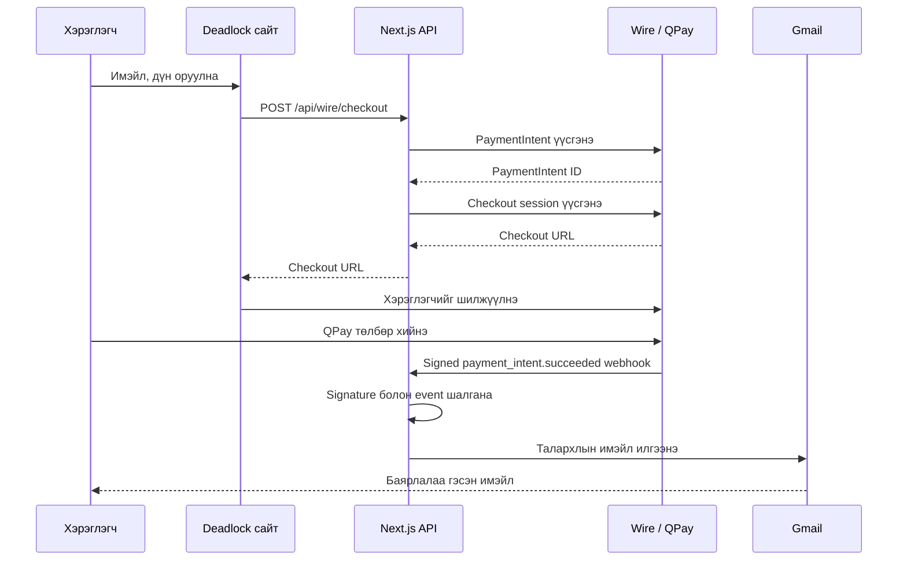

# Wire төлбөр ба Gmail талархлын имэйл

Энэ баримт нь Deadlock Mongolia сайтад хийсэн дараах урсгалыг бүрэн тайлбарлана:

1. хэрэглэгч имэйл болон төлөх дүнгээ оруулах;
2. backend-ээс Wire PaymentIntent үүсгэх;
3. Wire hosted checkout-оор QPay төлбөр авах;
4. Wire webhook-оор төлбөр амжилттай болсныг баталгаажуулах;
5. төлбөр хийсэн хүний имэйл рүү Gmail-ээр талархлын захиа илгээх.

> Энэ файлд бодит API key, webhook secret, Gmail App Password оруулаагүй. Тэдгээрийг зөвхөн Vercel Environment Variables эсвэл локал `.env.local` файлд хадгална.

## 1. Ашигласан технологи

| Технологи | Үүрэг |
| --- | --- |
| Next.js App Router | UI болон серверийн API route |
| React + TypeScript | Төлбөрийн modal, form, type checking |
| Wire REST API | PaymentIntent болон hosted checkout үүсгэх |
| QPay | Хэрэглэгч төлбөр хийх суваг |
| Wire webhook | Төлбөр үнэхээр амжилттай болсныг серверт мэдэгдэх |
| Nodemailer | Gmail SMTP ашиглан имэйл илгээх |
| Gmail App Password | Серверээс Gmail рүү аюулгүй нэвтрэх |
| Vercel | Production hosting, environment variable, server logs |

## 2. Нийт ажиллагааны урсгал



`?payment=success` query parameter нь зөвхөн хэрэглэгчид амжилтын мэдэгдэл харуулах зориулалттай. Төлбөрийн жинхэнэ баталгаа нь Wire-ийн signed webhook юм.

## 3. Өөрчлөгдсөн болон нэмэгдсэн файлууд

| Файл | Үүрэг |
| --- | --- |
| `components/support-checkout.tsx` | Имэйл, дүн авах modal болон checkout хүсэлт |
| `app/support-checkout.css` | Modal-ийн desktop/mobile дизайн |
| `app/api/wire/checkout/route.ts` | Wire PaymentIntent болон checkout session үүсгэх backend |
| `app/api/wire/webhook/route.ts` | Webhook signature шалгах, Gmail илгээх backend |
| `app/layout.tsx` | `SupportCheckout` component болон CSS-ийг бүх хуудсанд холбох |
| `package.json` | `nodemailer` dependency нэмэх |
| `package-lock.json` | Dependency-ийн lock мэдээлэл |
| `.env.example` | Шаардлагатай environment variable-ийн загвар |
| `README.md` | Ажиллуулах, тохируулах товч заавар |

## 4. Төлбөрийн modal

Файл:

```text
components/support-checkout.tsx
```

Энэ нь client component тул файлын эхэнд:

```tsx
"use client";
```

гэж бичсэн. Modal нь browser event, form state болон API хүсэлт ашигладаг учраас client талд ажиллах шаардлагатай.

### 4.1 State-үүд

```tsx
const [open, setOpen] = useState(false);
const [email, setEmail] = useState("");
const [amount, setAmount] = useState("5000");
const [loading, setLoading] = useState(false);
const [error, setError] = useState("");
```

- `open` — modal нээлттэй эсэх;
- `email` — хэрэглэгчийн имэйл;
- `amount` — төлөх дүн;
- `loading` — Wire checkout үүсэж байх үеийн төлөв;
- `error` — хэрэглэгчид харуулах алдаа.

### 4.2 Хуучин Wire link-ийг modal болгох

Сайтын хуучин хэсгүүд дотор `https://pay.wire.mn/link/...` линк байж болох тул document-ийн click event-ийг сонсож, тэр линк дарагдсан үед шууд Wire рүү үсрэхийн оронд шинэ modal-ийг нээнэ.

```tsx
const link = target.closest<HTMLAnchorElement>(
  'a[href^="https://pay.wire.mn/link/"]',
);

if (!link) return;

event.preventDefault();
openCheckout();
```

Ингэснээр хуучин товч, item detail доторх дэмжлэгийн линк зэрэг нь бүгд нэг шинэ checkout урсгалыг ашиглана.

### 4.3 Form validation

```tsx
<input
  type="email"
  maxLength={254}
  required
/>

<input
  type="number"
  min="1"
  max="1000000"
  step="1"
  required
/>
```

Frontend дээр:

- зөв имэйл хэлбэр шаардана;
- хамгийн багадаа `1₮`;
- хамгийн ихдээ `1,000,000₮`;
- зөвхөн бүхэл тоо авна.

Frontend validation-ийг өөрчилж тойрч болдог учраас backend яг ижил дүрмийг дахин шалгадаг.

### 4.4 Checkout хүсэлт

Form submit хийхэд:

```tsx
const response = await fetch("/api/wire/checkout", {
  method: "POST",
  headers: { "Content-Type": "application/json" },
  body: JSON.stringify({
    email: email.trim(),
    amount: Number(amount),
  }),
});
```

Backend-ээс `url` ирвэл:

```tsx
window.location.assign(result.url);
```

гэж хэрэглэгчийг Wire hosted checkout руу шилжүүлнэ.

## 5. Root layout-д modal холбосон нь

Файл:

```text
app/layout.tsx
```

```tsx
import { SupportCheckout } from "../components/support-checkout";
import "./support-checkout.css";

// ...

<body>
  {children}
  <SupportCheckout />
  <Analytics />
</body>
```

`SupportCheckout`-ийг root layout-д байрлуулсан тул сайтын аль ч хэсэг дэх дэмжлэгийн товч modal-ийг нээж чадна.

## 6. Checkout backend API

Файл:

```text
app/api/wire/checkout/route.ts
```

Endpoint:

```http
POST /api/wire/checkout
```

Request body:

```json
{
  "email": "customer@example.com",
  "amount": 1
}
```

### 6.1 Server-side validation

```ts
const EMAIL_PATTERN = /^[^\s@]+@[^\s@]+\.[^\s@]+$/;
const MIN_AMOUNT = 1;
const MAX_AMOUNT = 1_000_000;
```

Backend дараахыг шалгана:

- `WIRE_SECRET_KEY` байгаа эсэх;
- имэйл string мөн эсэх;
- имэйлийн үндсэн хэлбэр зөв эсэх;
- имэйл 254 тэмдэгтээс урт биш эсэх;
- дүн бүхэл тоо эсэх;
- дүн `1–1,000,000₮` хооронд эсэх.

### 6.2 Wire API helper

`wireRequest()` нь Wire рүү хийх давтагддаг хүсэлтийг нэг газар төвлөрүүлсэн.

```ts
const response = await fetch(`https://api.wire.mn/v1${path}`, {
  method: "POST",
  headers: {
    Authorization: `Bearer ${apiKey}`,
    "Content-Type": "application/json",
    "Idempotency-Key": idempotencyKey,
  },
  body: JSON.stringify(body),
  cache: "no-store",
});
```

Чухал хэсгүүд:

- `Authorization` — Wire API key зөвхөн серверээс илгээгдэнэ;
- `Idempotency-Key` — ижил хүсэлтийг санамсаргүй давхар боловсруулах эрсдэлийг бууруулна;
- `cache: "no-store"` — төлбөрийн API хариуг cache хийхгүй;
- Wire-ийн алдааны нарийн мэдээллийг server log-д бичиж, хэрэглэгчид ерөнхий Монгол алдаа харуулна.

### 6.3 PaymentIntent үүсгэх

```ts
const intent = await wireRequest(
  "/payment_intents",
  apiKey,
  {
    amount,
    currency: "MNT",
    description: "Deadlock Mongolia дэмжлэг",
    automatic_operator: true,
    allowed_operators: allowedOperators,
    metadata: {
      customer_email: email,
      source: "deadlock-mongolia",
    },
  },
  `deadlock-donation-${requestId}`,
);
```

Энд хэрэглэгчийн имэйлийг `metadata.customer_email` дотор хадгалсан. Дараа нь webhook ирэхэд яг аль имэйл рүү баярлалаа захиа явуулахыг үүнээс олно.

`WIRE_ALLOWED_OPERATORS` нь одоогоор `qpay`. Олон operator зөвшөөрөх бол таслалаар тусгаарлаж болно.

### 6.4 Checkout session үүсгэх

```ts
const checkout = await wireRequest(
  "/checkout/sessions",
  apiKey,
  {
    payment_intent: intent.id,
    success_url: `${origin}/?payment=success`,
    cancel_url: `${origin}/?payment=cancelled`,
  },
  `deadlock-checkout-${requestId}`,
);
```

- `success_url` — төлбөр амжилттай болсны дараа буцах хаяг;
- `cancel_url` — хэрэглэгч төлбөрөө цуцалбал буцах хаяг.

Wire-ээс ирсэн checkout URL заавал:

```text
https://pay.wire.mn/
```

гэж эхэлж байгаа эсэхийг шалгасны дараа frontend рүү буцаана.

## 7. Wire webhook backend

Файл:

```text
app/api/wire/webhook/route.ts
```

Production webhook URL:

```text
https://dead-lock-mongolia.vercel.app/api/wire/webhook
```

Сонсох үндсэн event:

```text
payment_intent.succeeded
```

### 7.1 Health check

```http
GET /api/wire/webhook
```

Энэ нь endpoint ажиллаж байгаа болон `WIRE_WEBHOOK_SECRET` тохирсон эсэхийг boolean утгаар харуулна. Secret-ийн өөрийн утгыг хэзээ ч буцаахгүй.

### 7.2 Signature header задлах

Wire дараахтай төстэй header илгээнэ:

```text
WirePayment-Signature: t=TIMESTAMP,v1=HEX_SIGNATURE
```

`parseSignature()` нь `t` болон `v1` утгыг салгаж авна.

### 7.3 Хугацаа шалгах

```ts
const MAX_SIGNATURE_AGE_SECONDS = 300;
```

Webhook timestamp нь одоогийн цагаас 5 минутаас их зөрсөн бол request-ийг `401` болгоно. Энэ нь хуучин signed request-ийг дахин тоглуулах эрсдэлийг бууруулна.

### 7.4 HMAC-SHA256 баталгаажуулалт

```ts
const rawBody = await request.text();
const expected = createHmac("sha256", secret)
  .update(`${parsed.timestamp}.${rawBody}`)
  .digest("hex");
```

Эхлээд `request.text()` ашиглах нь чухал. Signature нь Wire-ийн илгээсэн яг тэр raw body дээр тооцогдсон байдаг. Signature шалгахаас өмнө `request.json()` хийж body-г өөрчилж болохгүй.

Дараа нь:

```ts
timingSafeEqual(expectedBuffer, receivedBuffer)
```

ашиглан хоёр signature-ийг тогтмол хугацааны харьцуулалтаар шалгана.

Signature зөв биш бол имэйл явуулахгүй, `401` буцаана.

### 7.5 Event болон metadata унших

Wire event-ийн `data` нь шууд PaymentIntent эсвэл `data.object` хэлбэртэй ирж болох тул `getPaymentIntent()` хоёр хувилбарыг дэмждэг.

```ts
if (event.type === "payment_intent.succeeded") {
  const paymentIntent = getPaymentIntent(event);
  const email = paymentIntent?.metadata?.customer_email;
}
```

Хуучин payment link-ээр үүссэн, `customer_email` metadata байхгүй төлбөр дээр имэйл явуулахгүй.

Зарим webhook payload metadata-г бүтнээр нь агуулахгүй байж болох тул код эхлээд
PaymentIntent ID-г олж, шаардлагатай үед:

```http
GET /v1/payment_intents/{id}
```

хүсэлтээр Wire API-аас бүрэн PaymentIntent-ийг дахин авна. Ингээд
`metadata.customer_email`-ийг сэргээж талархлын имэйл илгээнэ. Vercel log-д
`Wire thank-you email sent` эсвэл metadata байхгүй бол тодорхой skip log бичигдэнэ.

## 8. Gmail талархлын имэйл

Package:

```bash
npm install nodemailer
npm install --save-dev @types/nodemailer
```

### 8.1 SMTP transporter

```ts
const transporter = nodemailer.createTransport({
  service: "gmail",
  auth: {
    user: process.env.GMAIL_USER,
    pass: process.env.GMAIL_APP_PASSWORD,
  },
});
```

Энгийн Gmail password ашиглахгүй. Google account дээр 2-Step Verification асааж, тусгай 16 тэмдэгт App Password үүсгэнэ.

### 8.2 Имэйл илгээх

```ts
await transporter.sendMail({
  from: `"Deadlock Mongolia" <${gmailUser}>`,
  to: email,
  subject: "Deadlock Mongolia-г дэмжсэнд баярлалаа!",
  messageId: `<wire-${eventId}@deadlock-mongolia>`,
  html: "...",
  text: "...",
});
```

- `to` — төлбөр хийхдээ оруулсан имэйл;
- `subject` — Монгол талархлын гарчиг;
- `messageId` — Wire event ID-тай холбоотой тогтвортой ID;
- `html` — дизайнтай имэйл;
- `text` — HTML харуулахгүй mail client-д зориулсан хувилбар.

Имэйл болон бусад dynamic утгыг HTML-д хийхээс өмнө `escapeHtml()` ашиглан тусгай тэмдэгтүүдийг escape хийдэг.

### 8.3 Имэйл илгээхэд алдаа гарвал

```ts
return NextResponse.json(
  { ok: false, error: "Email delivery failed" },
  { status: 503 },
);
```

Webhook-д `5xx` буцааснаар Wire түр зуурын алдааны үед event-ийг дахин илгээх боломжтой. Vercel log дотор алдааны дэлгэрэнгүй үлдэнэ.

## 9. Environment Variables

Локал хөгжүүлэлтэд `.env.local`, production-д Vercel Environment Variables ашиглана.

```env
WIRE_SECRET_KEY="sk_live_..."
WIRE_WEBHOOK_SECRET="whsec_..."
WIRE_ALLOWED_OPERATORS="qpay"
NEXT_PUBLIC_SITE_URL="https://dead-lock-mongolia.vercel.app"
GMAIL_USER="your-account@gmail.com"
GMAIL_APP_PASSWORD="xxxx xxxx xxxx xxxx"
```

| Variable | Тайлбар | Public байж болох уу? |
| --- | --- | --- |
| `WIRE_SECRET_KEY` | Server-ээс Wire API дуудах key | Үгүй |
| `WIRE_WEBHOOK_SECRET` | Webhook signature шалгах secret | Үгүй |
| `WIRE_ALLOWED_OPERATORS` | Зөвшөөрөх operator, одоогоор `qpay` | Тийм ч server env-д байлгана |
| `NEXT_PUBLIC_SITE_URL` | Success/cancel буцах production URL | Тийм |
| `GMAIL_USER` | Имэйл илгээх Gmail хаяг | Ил гаргах шаардлагагүй |
| `GMAIL_APP_PASSWORD` | Gmail-ийн 16 тэмдэгт App Password | Үгүй |

`.env.local` болон бодит нууцуудыг GitHub руу commit хийж болохгүй.

## 10. Wire dashboard тохиргоо

1. Wire dashboard дээр live API key үүсгэнэ.
2. Key-г Vercel-д `WIRE_SECRET_KEY` нэрээр хадгална.
3. Webhook endpoint үүсгэнэ.
4. URL дээр дараахыг оруулна:

   ```text
   https://dead-lock-mongolia.vercel.app/api/wire/webhook
   ```

5. `payment_intent.succeeded` event-ийг идэвхжүүлнэ.
6. Webhook signing secret-ийг `WIRE_WEBHOOK_SECRET` нэрээр Vercel-д хадгална.

API key болон webhook secret нь өөр зориулалттай:

- API key — манай сервер Wire рүү request хийхэд;
- webhook secret — Wire-ээс ирсэн request жинхэнэ эсэхийг манай сервер шалгахад.

## 11. Gmail тохиргоо

1. Имэйл илгээх Google account-д 2-Step Verification асаана.
2. Google App Passwords хэсэгт `Deadlock Mongolia` нэртэй password үүсгэнэ.
3. Gmail хаягийг `GMAIL_USER` болгоно.
4. 16 тэмдэгт App Password-ийг `GMAIL_APP_PASSWORD` болгоно.
5. Vercel дээр хоёуланг нь Production environment-д хадгална.
6. Environment variable өөрчилсний дараа deployment-ийг redeploy хийнэ.

Google account-ийн энгийн password-ийг код, GitHub эсвэл Vercel variable-д ашиглахгүй.

## 12. Vercel deployment

GitHub-ийн `main` branch шинэчлэгдэхэд Vercel автоматаар production build хийдэг.

Одоогийн production URL:

```text
https://dead-lock-mongolia.vercel.app/
```

Шалгах командууд:

```bash
npm run lint
npm run build
```

Environment variable нэмсэн эсвэл өөрчилсөн бол хуучин deployment автоматаар шинэ утга авахгүй. Шинэ deployment хийх эсвэл Vercel дээр Redeploy дарна.

## 13. Туршилт хийх

### 13.1 Webhook endpoint шалгах

```bash
curl https://dead-lock-mongolia.vercel.app/api/wire/webhook
```

Жишээ хариу:

```json
{
  "ok": true,
  "service": "wire-webhook",
  "configured": true
}
```

### 13.2 Бодит 1₮ төлбөрөөр шалгах

1. Production сайтыг нээнэ.
2. Дэмжлэгийн товч дарна.
3. Өөрийн шалгах имэйлээ оруулна.
4. Дүн дээр `1` оруулна.
5. QPay-аар 1₮ төлнө.
6. Сайт руу `?payment=success`-тай буцаж ирэхийг шалгана.
7. Оруулсан имэйлийн Inbox болон Spam хэсгийг шалгана.
8. Vercel Logs дээр `Wire webhook verified` log байгаа эсэхийг шалгана.

## 14. Алдаа оношлох

### Checkout нээгдэхгүй

- `WIRE_SECRET_KEY` зөв эсэхийг шалгах;
- Vercel variable Production орчинд нэмэгдсэн эсэхийг шалгах;
- `WIRE_ALLOWED_OPERATORS=qpay` эсэхийг шалгах;
- Vercel function log-оос `Wire API request failed` хайх.

### Төлбөр амжилттай ч имэйл ирэхгүй

- `GMAIL_USER` зөв Gmail хаяг эсэх;
- App Password яг тэр Gmail account-аас үүссэн эсэх;
- `GMAIL_APP_PASSWORD` зөв хуулсан эсэх;
- Gmail account дээр 2-Step Verification асаалттай эсэх;
- Wire webhook event идэвхтэй эсэх;
- webhook URL production домэйн заасан эсэх;
- Vercel log-оос `Wire webhook email processing failed` хайх;
- Spam folder шалгах.

### Webhook `401` буцаах

- `WIRE_WEBHOOK_SECRET` тухайн webhook endpoint-ийн secret мөн эсэх;
- secret солигдсон бол Vercel дээр шинэчилсэн эсэх;
- Wire server болон deployment-ийн цаг хэт зөрөөгүй эсэх;
- header-ийн нэр `WirePayment-Signature` мөн эсэх.

### Webhook `503` буцаах

- `WIRE_WEBHOOK_SECRET` байхгүй байж болно;
- Gmail environment variable байхгүй байж болно;
- Gmail App Password хүчингүй болсон байж болно;
- Gmail SMTP түр алдаатай байж болно.

## 15. Аюулгүй байдлын шийдлүүд

- Wire болон Gmail secret-үүд frontend bundle-д орохгүй.
- Checkout дүнг frontend болон backend дээр давхар шалгана.
- Зөвхөн `1–1,000,000₮` бүхэл дүн зөвшөөрнө.
- Wire API хүсэлт бүр unique idempotency key ашиглана.
- Checkout URL зөвхөн `https://pay.wire.mn/` домэйнтэй эсэхийг шалгана.
- Webhook raw body дээр HMAC-SHA256 signature шалгана.
- Webhook timestamp-д 5 минутын хязгаар тавьсан.
- Signature-ийг `timingSafeEqual()` ашиглан харьцуулна.
- Зөвхөн `payment_intent.succeeded` event дээр имэйл явуулна.
- Dynamic имэйл утгыг HTML escape хийнэ.
- Алдааны дотоод мэдээллийг хэрэглэгчид шууд ил гаргахгүй.

## 16. Хийсэн commit-үүд

| Commit | Өөрчлөлт |
| --- | --- |
| `d51d29e` | Wire API checkout, email metadata, signed webhook email урсгал |
| `a53c685` | Имэйл provider-ийг Gmail SMTP + Nodemailer болгосон |
| `8f948f1` | Төлбөрийн доод хэмжээг `1₮` болгосон production commit |

## 17. Товч дүгнэлт

Одоогийн хувилбар нь статик Wire payment link биш. Хэрэглэгч бүрийн имэйл болон дүнгээр backend дээр шинэ PaymentIntent үүсгэдэг. Төлбөр амжилттай болсныг browser-ийн success URL-д итгэж шийдэхгүй; Wire-ийн signed webhook-ийг шалгасны дараа л Gmail талархлын имэйл илгээдэг.
